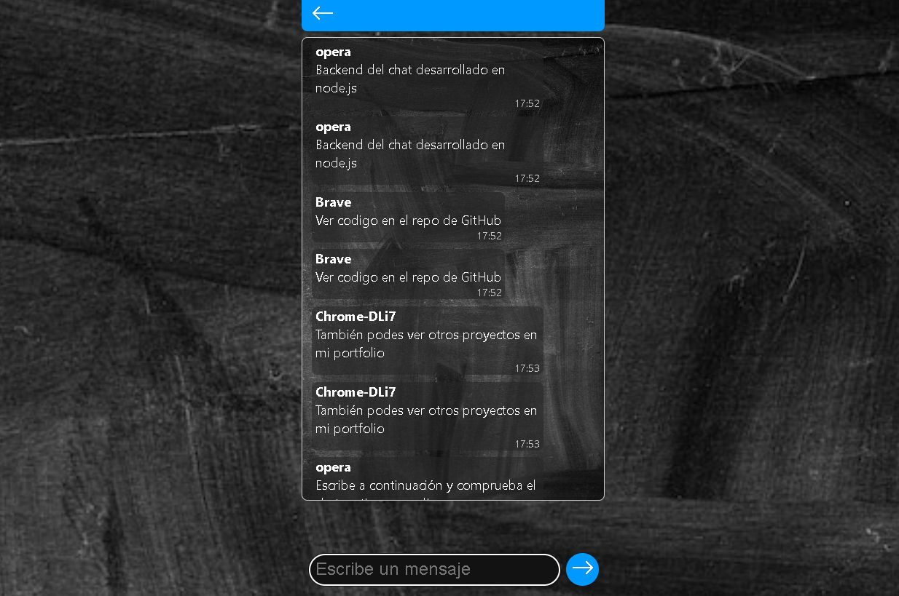

# Simple Chat microservice

### Chat microservice based on node.js and express, with websockets.

### Message persistence in database.

### Includes an ultra-lightweight JS interface.

#### [This backend works with the Socket.io dependency](https://www.npmjs.com/package/socket.io). Which is written in TypeScript.

---

### You can see a working example [here](https://sergioortega.com.ar/#/portfolio). Please be patient when loading as sometimes the server is asleep.

#### common troubleshooting:

##### If the container does not deploy successfully, check the DB's operational status in Turso.
